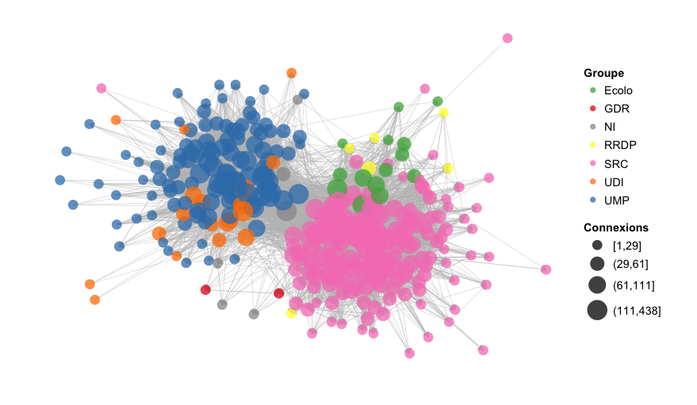
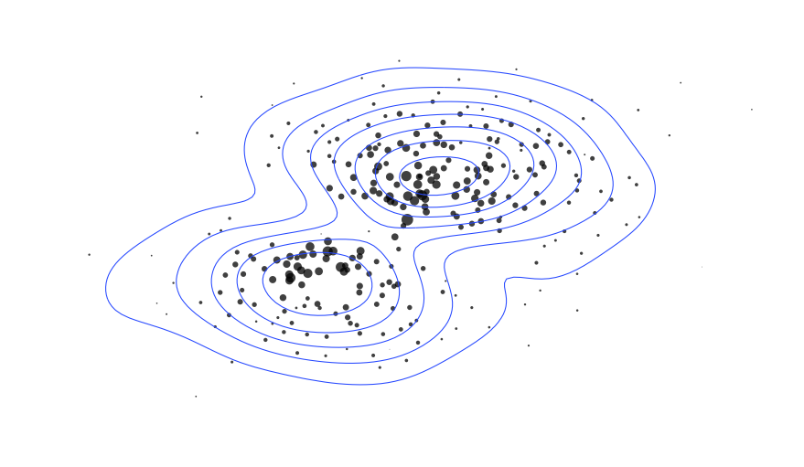
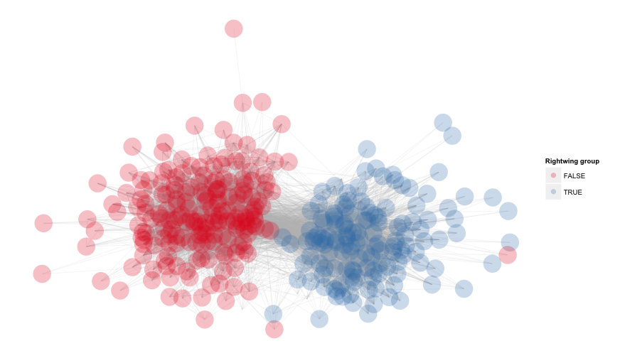
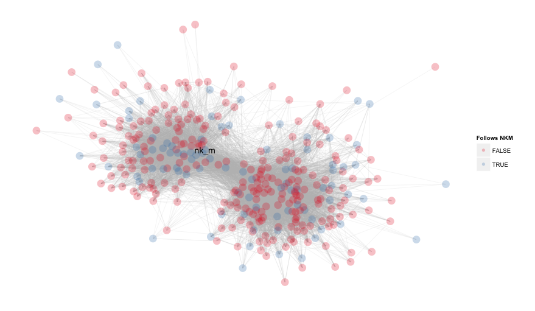
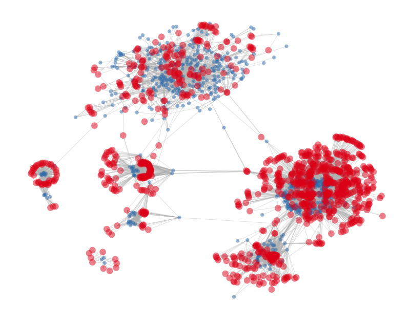

## ggnet: simple network plots with ggplot2

This function is part of the [GGally][ggally] package. Install from GitHub:

    devtools::install_github("ggally", "ggobi")

[ggally]: https://github.com/ggobi/ggally

A plot of Twitter connexions between 339 French MPs currently in office, colored by parliamentary groups and quartile-weighted by degree. See [`functions.R`][fn] for network exploration routines. Data assembled by scraping a few web sources in May 2013 with the help of [Jonathan Chibois][jc] and Benjamin Ooghe-Tabanou from [Regards Citoyens][rc]. My [blog post at Polit'bistro][pb] has more details.

[bc]: http://coulmont.com/index.php?s=d%C3%A9put%C3%A9s
[jc]: http://laspic.hypotheses.org/
[rc]: http://www.regardscitoyens.org/
[eg]: http://freakonometrics.blog.free.fr/index.php?post/Twitter-deputes
[fn]: functions.R
[pb]: http://politbistro.hypotheses.org/1752

## HOWTO

The functions builds on Moritz Marbach's [`plotg()`][mm] function and accepts the following arguments:

    ggnet(net,                          # an object of class network
          mode = "fruchtermanreingold", # placement algorithm
          size = 12,                    # node size
          alpha = .75,                  # transparency
          weight.method = "none",       # what to weight the nodes with: "degree", "indegree", "outdegree"
          names = c("", ""),            # what to call the node color and node weight legends
          node.group = NULL,            # what to color the nodes with
          node.color = NULL,            # what colors to use for the node classes
          node.alpha = NULL,            # transparency for nodes (inherits from alpha)
          segment.alpha = NULL,         # transparency for links (inherits from alpha)
          segment.color = "grey",       # default links are rgb(190, 190, 190)
          segment.size  = .25,          # set to 0 to remove from plot
          arrow.size = 0,               # set to 0 to remove from plot
          label.nodes = FALSE,          # add vertex names in small print; can be a list of vertex names
          top8.nodes  = FALSE,          # color the top 8 nodes by weighting method with ColorBrewer Set1
          trim.labels = TRUE,           # remove '@', 'http://' and 'www.' from vertex names
          quantize.weights = FALSE,     # break weights to quartiles
          subset.threshold = 0,         # what nodes to exclude, based on weight.method ≥ subset
          legend.position = "right",    # set to "none" to remove from plot
          ...)                          # arguments passed to node labels with geom_text()

[mm]: http://sumtxt.wordpress.com/2011/07/02/visualizing-networks-with-ggplot2-in-r/

The function needs an object of class `network` and automatically handles the conversion of objects of class `igraph` by calling the [`intergraph`][ig] package. It supports all placement algorithms available through the `sna` package. The code has been submitted to the [`GGally`][gg] package.

[ig]: http://intergraph.r-forge.r-project.org/
[gg]: https://github.com/ggobi/ggally

## DEMO

The `ggnet()` function returns a `ggplot` object in which nodes are represented by points that can be colored and/or weighted using proportional scaling. The network above can therefore be set to look like this when the segments are not drawn and the nodes are weighted by indegree and left uncolored:

    ggnet(net, 
          size = 6, 
          segment.size = 0, 
          weight = "indegree", 
          legend = "none") + 
      geom_density2d()

The node colors are set through a group variable colored by a discrete palette. Node groups can be any vector containing as many items as there are nodes in the network. Hence, to verify that the dual structure shown above corresponds to the left-right party divide, we group nodes by a logical value and let the function select from the default `Set1` scheme to discriminate them:

    rightwing = ifelse(mp.groups == "NI", NA, mp.groups %in% c("UDI", "UMP"))
    ggnet(net, 
          node.group = rightwing, 
          alpha = .25, 
          name = "Rightwing group")

The function can also label all or a selection of nodes, identified by vertex names. See, for example, how party polarization is much less obvious when you look at a single individual's network (Nathalie Kosciusko-Morizet in this example, the rightwing candidate for the mayor of Paris in the next municipal election):

    follows.nkm = ids$Twitter %in% who.follows(df, "nk_m")$followers
    ggnet(net, 
          size = 6, 
          node.group = follows.nkm, 
          alpha = .25, 
          name = "Follows NKM",
          label = "nk_m", 
          color = "black")

The function contains a few examples with small random networks, as well as an example using the [city and service firms dataset][cs] that is [also available][pj] in Pajek. The visualization below uses the Kamada-Kawai placement algorithm with no node weighting, a few node labels and a default three-color scheme built from ColorBrewer's `Set1`:

[cs]: http://networkdata.ics.uci.edu/netdata/html/cities.html
[pj]: http://vlado.fmf.uni-lj.si/pub/networks/data/

    url = url("http://networkdata.ics.uci.edu/netdata/data/cities.RData")
    print(load(url))
    close(url)
    type = network::get.vertex.attribute(cities, "type")
    type = ifelse(grepl("City|Law", type), gsub("I+", "", type), "Firm")
    ggnet(cities,
          mode = "kamadakawai",
          alpha = .2,
          node.group = type,
          label = c("Paris", "Beijing", "Chicago"),
          color = "darkred")

Some of the more experimental arguments like `subset.threshold` and `top8.nodes`, which highlight the most central nodes of a network, are shown in the [code][vo] for a [conference paper][bg] using online network data collected with [VOSON][vs]:

[co]: https://github.com/briatte/afsp2013/blob/master/voson.R
[bg]: https://github.com/briatte/afsp2013
[vs]: http://voson.anu.edu.au/
[vo]: https://github.com/briatte/afsp2013/blob/master/voson.R

Finally, Pedro Jordano has [suggested][issue-3] adding support for bipartite networks. While `ggnet` draws only "simple" one-mode networks at the moment, it can also mimick two-mode networks, as shown in [this example][neta], using amendment co-sponsorships in the lower chamber of the French Parliament:

    # manipulate vertex labels
    i = network.vertex.names(net)
    # remove labels from actor nodes
    i[1:min(which(!is.na(as.numeric(i)))) - 1] = NA
    # mock bipartite network
    ggnet(net, size = 0, node.group = is.na(i)) + 
      geom_point(alpha = .5, aes(size = ifelse(is.na(i), 1, 3))) + 
      scale_size_area("", max_size = 6) +
      theme(legend.position = "none")

[issue-3]: https://github.com/briatte/ggnet/issues/3
[neta]: https://github.com/briatte/neta

(The code snippet above is a practical hack. There is far better code to produce authentic bipartite plots out of sparse matrix objects in the [dedicated repository][neta] for this example.)

## CREDITS

Inspired by [Baptiste Coulmont][bc] and [Ewen Gallic][eg].
