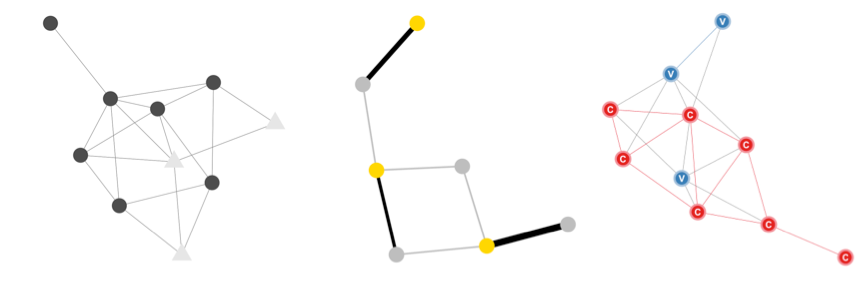

# ggnet: network visualization with ggplot2



This repository contains the latest versions of the `ggnet` and `ggnet2` functions, which allow to visualize networks as [`ggplot2`](http://ggplot2.org/) objects.

## INSTALL

`ggnet` and `ggnet2` are part of the __GGally__ package. Install it from CRAN or from GitHub:

```{r}
install.packages("GGally")
devtools::install_github("ggobi/ggally")
```

You can also install `ggnet` and `ggnet2` as standalone functions from this repository:

```{r}
source("https://raw.githubusercontent.com/briatte/ggnet/master/ggnet.R")
source("https://raw.githubusercontent.com/briatte/ggnet/master/ggnet2.R")
```

## VIGNETTE

The `ggnet2` function is fully documented in [this vignette](https://briatte.github.io/ggnet/).

## THANKS

- [Moritz Marbach](https://github.com/sumtxt) coded the [very first version of the function](http://sumtxt.wordpress.com/2011/07/02/visualizing-networks-with-ggplot2-in-r/)
- [Pedro Jordano](https://github.com/pedroj) suggested adding support for [bipartite networks](https://github.com/pedroj/bipartite_plots)
- [Baptiste Coulmont](http://coulmont.com/index.php?s=d%C3%A9put%C3%A9s) and [Ewen Gallic](http://freakonometrics.blog.free.fr/index.php?post/Twitter-deputes) provided further inspiration
- [Barret Schloerke](https://github.com/schloerke) helps by maintaining the `GGally` package
